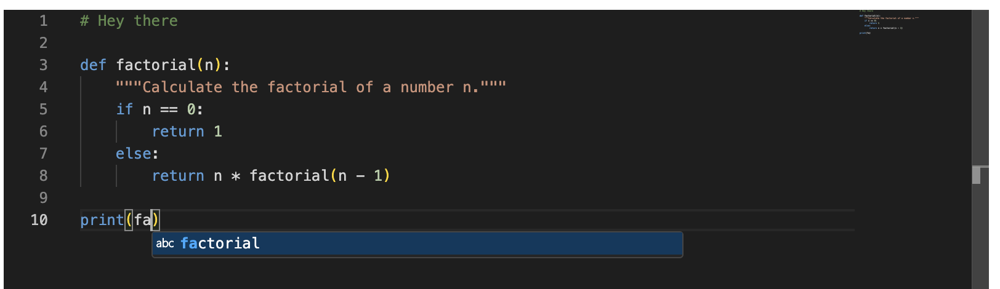

# React, Vite, Monaco Editor, TypeScript, and Python Language Support

This example shows how to use Vite with Monaco Editor to obtain support for additional languages such as Python, which don't work out of the box.



## How to use

Clone this repository and run the following commands:

```
npm install
npm run dev
```
